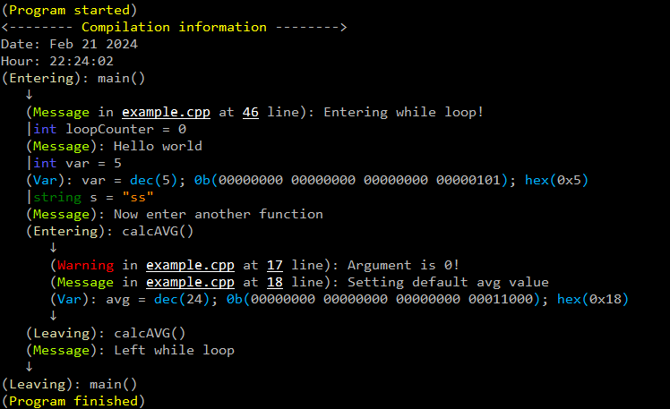
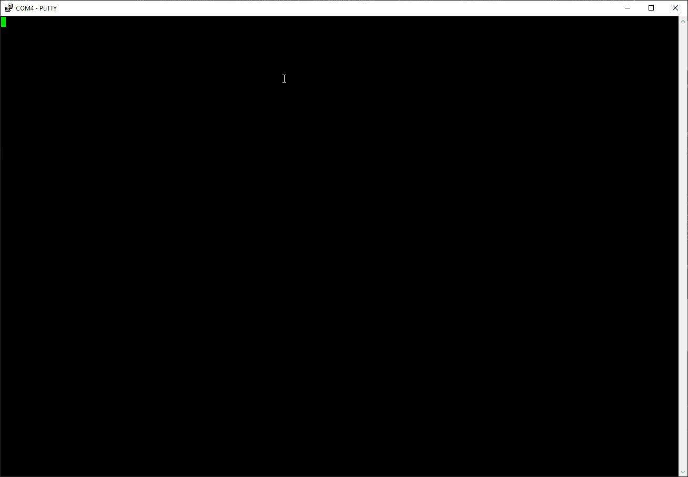

# Raspberry Pi Pico Logger
## About
This repository is called **RPi-Pico-Logger** and it contains a lightweight C++ logger specifically designed for debugging and logging purposes of the Raspberry Pi Pico (RP2040) microcontroller. 

## Features
- Logs events via the serial port for easy debugging.
- Allows logging of various types of data.
- Provides logging for messages, warnings, variables, functions, and classes.
- Enhances the development experience for Raspberry Pi Pico projects.

## Requirements
- Source code placed inside the project with correct configuration.
- [Putty](https://www.chiark.greenend.org.uk/~sgtatham/putty/) for observing the output.

## Output
After running the example code, this is the output that can be observed via tools like Putty.
### Screenshot

### Screen-recording


## Example

```cpp
#include <stdio.h>
#include "pico/stdlib.h"
#include "../src/Logger.h"

void calcAVG()
{
    // For function to be logged, LOG_ENTER() and LOG_LEAVE() are necessary.
    LOG_ENTER();

    // Simple text to console.
    LOG_WARNING_EXT("Argument is 0!");
    LOG_MESSAGE_EXT("Setting default avg value");

    int avg = 24;
    // Printing hex, bin value of "avg" variable.
    LOG_VARIABLE_INFO(avg);

    LOG_LEAVE();
}

int main()
{
    stdio_init_all();

    // Initializing logger. Parameter is number of white space sign in logging tree. For 3 => "___" etc...
    LOG_INITIALIZE(3);

    // Placing LOG_START_PROGRAM() causes program to stop until "Enter" key is pressed.
    LOG_START_PROGRAM();

    // Display compilation information.
    LOG_PRINT_COMPILATION_INFO();

    // First enter.
    LOG_ENTER();

    int loopCounter = 0;

    // Message with additional information.
    LOG_MESSAGE_EXT("Entering while loop!");
    while (loopCounter < 1)
    {
        LOG_VARIABLE(Logger::Type::Int, loopCounter);

        LOG_MESSAGE("Hello world");
        int var = 5;
        std::string s = "ss";

        // To log variable value, LOG_VARIABLE() can be used, it requires Logger::Type to be passed.
        LOG_VARIABLE(Logger::Type::Int, var);

        // Another way to log variable is to LOG_VARIABLE_INFO(). It is used for numeric variable types.
        LOG_VARIABLE_INFO(var);

        // To log string type variable, use LOG_VARIABLE_STRING().
        LOG_VARIABLE_STRING(s);

        // Simple message.
        LOG_MESSAGE("Now enter another function");

        calcAVG();
        sleep_ms(1000);
        loopCounter++;
    }
    LOG_MESSAGE("Left while loop");
    LOG_LEAVE();

    // Exiting logging.
    LOG_EXIT_PROGRAM();
    return 0;
}
```

## Codebase Documentation
Documentation for this micro-library is located in the [**src/README.md**](https://github.com/DarekKrawczyk/RPi-Pico-Logger/tree/master/src) file.

## How to use it
This section will provide information how to run examplary code, and how to add this logging features to your project!
### How to run example code
1. Clone this repository to your Raspberry Pi Pico project directory:

    ```bash
    git clone https://github.com/DarekKrawczyk/RPi-Pico-Logger.git
    ```

2. Open Visual Studio Code with Pico enviorimental path loaded.

3. Build project.

4. Place output file inside Rasbperry Pi Pico.
    ```
    Path: PicoLogger\build\example.uf2
    ```
5. Run tool that can display serial communication. For example **Putty**.
### How to add logger to your project
1. Clone this repository to your Raspberry Pi Pico project directory:

    ```bash
    git clone https://github.com/DarekKrawczyk/RPi-Pico-Logger.git
    ```

2. Go to:
    ```
    PicoLogger\src
    ```
    and copy this folder to your project. It is best to place it in the main folder, near **build** and **.vscode** folders.

3. Go to your **'CMakeLists.txt'**.
4. Make sure that both files are included in **add_executable** directive.
   ```make
    add_executable(...
        ...
        src/Logger.h
        src/Logger.cpp
    )
   ```
5. Make sure to use serial:
   ```cpp
    pico_enable_stdio_usb('your-project-name' 1)
    pico_enable_stdio_uart('your-project-name' 0)
   ```

6. Now leave **'CMakeLists.txt'** and navigate to your main **.cpp** file. Make sure to include Logger header file.
    ```cpp
    #include "../src/Logger.h"
    ```
7. Build project.

8. Place output file inside Rasbperry Pi Pico.
    ```
    PicoLogger\build\main.uf2
    ```
    This assumes that your **.cpp** file is called **'main.cpp'**.
9. Run tool that can display serial communication. For example **Putty**.
